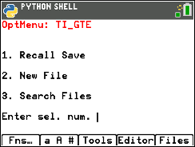
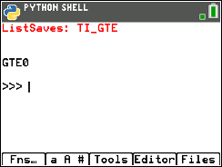
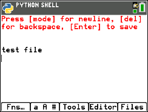
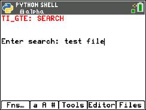

# TI_GTE
> A General Text Editor for the TI Python Calcs

<br />

## Disclaimer
_The developer of this program is in no way responsible for the mis-use of this program, including, but not limited to: academic dishonesty, cheating, and any other non-educational use._

<br />

# Requirements
TI-84 Plus CE Python, TI-Nspire CX II, or similar

_Python must be installed (included already in the listed calcs above)_

<br />

# Install
1. Download this repo (clickk the green "Download" button
2. Download [TI Connect CE](https://education.ti.com/en/products/computer-software/ti-connect-ce-sw) or another calculator file tool
3. Unzip the TI_GTE folder, and drag the ``TI_GTE.8xv`` file to your calculator (using the installed file tool and a plugged in calculator)
4. When installed, navigate to the ``PRGM`` menu on your calculator, and select "Python"


5. In the Python dialogue, select the ``TI_GTE`` program, and run it by pressing the ``y=`` key
 


<br />

# Usage/Examples
1. Selection Menu: Enter a number (1-3) to take you to the specified page



2. ``Recall Save`` (Opt. 1): List all files saved by the TI_GTE program previously



3. ``New File`` (Opt. 2): Create a new file, write text in it, and save it.



4. ``Search Saves`` (Opt. 3): Search for a specified term in all of your saved files



<br />

# License
```
Copyright © 2021 Finn Lancaster

Permission is hereby granted, free of charge, to any person obtaining a copy of this software and
associated documentation files (the “Software”), to deal in the Software without restriction, including
without limitation the rights to use, copy, modify, merge, publish, distribute, sublicense, and/or sell
copies of the Software, and to permit persons to whom the Software is furnished to do so, subject to the
following conditions:

The above copyright notice and this permission notice shall be included in all copies or substantial
portions of the Software.

THE SOFTWARE IS PROVIDED “AS IS”, WITHOUT WARRANTY OF ANY KIND, EXPRESS OR IMPLIED, INCLUDING BUT NOT
LIMITED TO THE WARRANTIES OF MERCHANTABILITY, FITNESS FOR A PARTICULAR PURPOSE AND NONINFRINGEMENT. IN NO
EVENT SHALL THE AUTHORS OR COPYRIGHT HOLDERS BE LIABLE FOR ANY CLAIM, DAMAGES OR OTHER LIABILITY, WHETHER IN
AN ACTION OF CONTRACT, TORT OR OTHERWISE, ARISING FROM, OUT OF OR IN CONNECTION WITH THE SOFTWARE OR THE USE
OR OTHER DEALINGS IN THE SOFTWARE.
```
