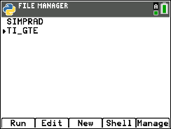

# TI_GTE
> A General Text Editor for the TI Python Calcs

 

## Disclaimer
_The developer of this program is in no way responsible for the mis-use of this program, including, but not limited to: academic dishonesty, cheating, and any other non-educational use._

 

# Requirements
TI-84 Plus CE Python, TI-Nspire CX II, or similar

_Python must be installed (included already in the listed calcs above)_

 

# Install
1. Download this repo (clickk the green "Download" button
2. Download [TI Connect CE](https://education.ti.com/en/products/computer-software/ti-connect-ce-sw) or another calculator file tool
3. Unzip the TI_GTE folder, and drag the ``TI_GTE.8xv`` file to your calculator (using the installed file tool and a plugged in calculator)
4. When installed, navigate to the ``PRGM`` menu on your calculator, and select "Python"

5. In the Python dialogue, select the ``TI_GTE`` program, and run it by pressing the ``y=`` key
 

 

# Usage/Examples
1. Selection Menu: Enter a number (1-3) to take you to the specified page
![sel. menu](captures/

 

# License
